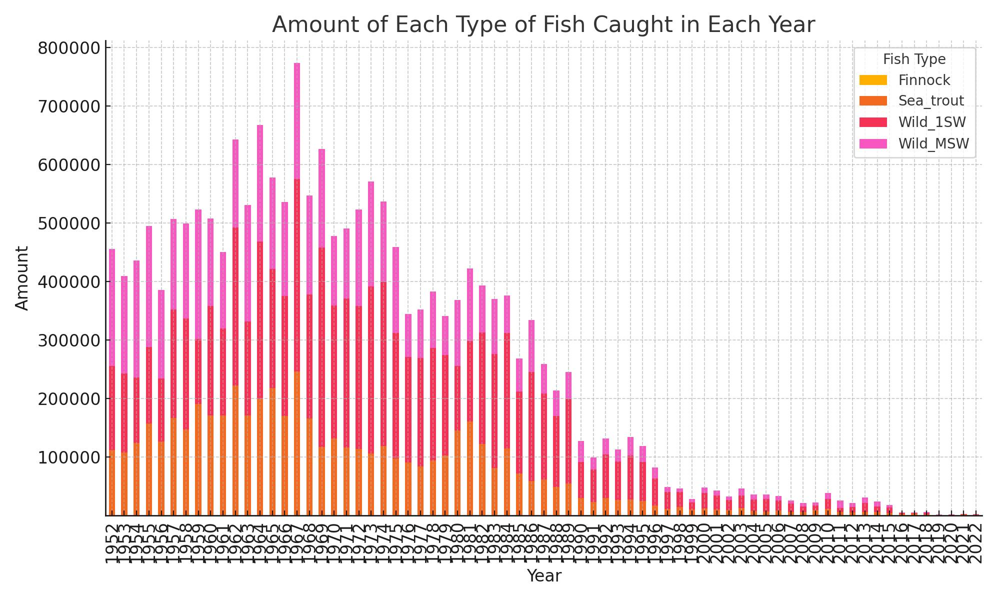
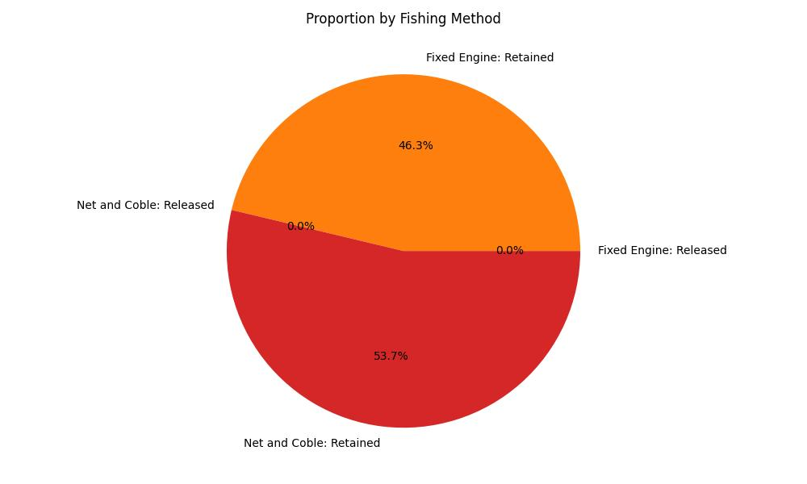
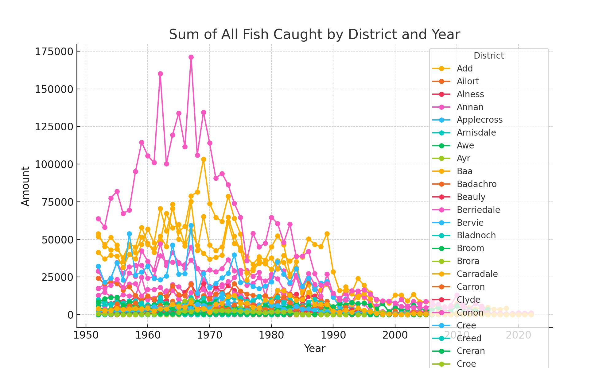

<!DOCTYPE html>
<html>
<head>
    <title>Salmon Catching Data Analysis</title>
</head>
<body>
    <h1>Salmon Catching Data Analysis</h1>
    
This project analyzes salmon catching data to gain insights and make predictions.

    <h2>Table of Contents</h2>
    <ol>
        <li><a href="#introduction">Introduction</a></li>
        <li><a href="#data-exploration">Data Exploration</a></li>
        <li><a href="#data-cleaning">Data Cleaning</a></li>
        <li><a href="#data-analysis">Data Analysis</a></li>
        <li><a href="#model-building">Model Building</a></li>
        <li><a href="#conclusion">Conclusion</a></li>
    </ol>   
    <h2 id="introduction">Introduction</h2>
    
This section provides an overview of the project and its objectives.

    <h2 id="data-exploration">Data Exploration</h2>
    
Exploratory data analysis was conducted to understand the structure and characteristics of the data.

    <h2 id="data-cleaning">Data Cleaning</h2>
    
The data was cleaned and prepared for analysis, including handling missing values and outliers.

    <h2 id="data-analysis">Data Analysis</h2>
    
The data analysis includes the following components:

    <h3>Amount of Each Type of Fish Caught in Each Year</h3>
    
    <h3>Proportion by Fishing Method</h3>
    
    <h3>Sum of All Fish Caught by District and Year</h3>
    
    <h2 id="model-building">Model Building</h2>
    
Various predictive models were built and evaluated to forecast future trends in salmon catching.

    <h2 id="conclusion">Conclusion</h2>
    
This project provides a comprehensive analysis of salmon catching data and demonstrates various data science techniques, from data cleaning to model building.

    <h2>Data</h2>
    
The dataset used for this analysis contains information about salmon catching incidents, including various features that can be used for predictive modeling.

    <h2>Usage</h2>
    
To run the notebook and replicate the analysis, you need to have Jupyter Notebook installed. Load the notebook and run each cell sequentially.

    <h2>Requirements</h2>
    
The following Python libraries are required:

    <ul>
        <li>pandas</li>
        <li>numpy</li>
        <li>matplotlib</li>
        <li>seaborn</li>
        <li>scikit-learn</li>
    </ul>
    <h2>Conclusion</h2>
    
This project provides a comprehensive analysis of salmon catching data and demonstrates various data science techniques, from data cleaning to model building.

</body>
</html>
