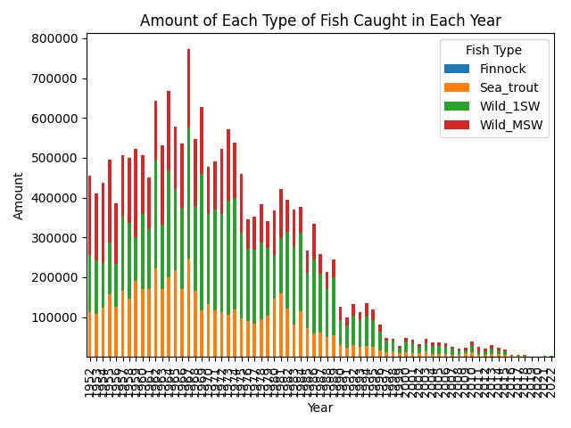

<h1>Salmon Catching Data Analysis</h1>

This project analyzes salmon catching data to gain insights and make predictions.

<h2 id="introduction">Introduction</h2>

This section provides an overview of the project and its objectives.

<h2 id="data-exploration">Data Exploration</h2>

Exploratory data analysis was conducted to understand the structure and characteristics of the data.

<h2 id="data-cleaning">Data Cleaning</h2>

The data was cleaned and prepared for analysis, including handling missing values and outliers.

<h3>Amount of Each Type of Fish Caught in Each Year</h3>

<h4>Trend Analysis</h4>

 - There is a noticeable decline in the amount of fish caught across all types from the peak in the mid-1990s to 2020. 

 - Wild_1SW and Wild_MSW have the most significant declines, while Finnock and Sea_trout also show a reduction. 

<h4>Key Observations</h4>

 - The decline in all types of fish suggests a broader ecological issue affecting all fish populations. 

 - Potential reasons could include overfishing, climate change, pollution, and changes in water quality or habitat.

<h3>Proportion by Fishing Method</h3>

<h4>Trend Analysis</h4>

 - Net and Coble: Retained method is the most predominant, accounting for 53.7% of the catches. 

 - Fixed Engine: Retained method follows, making up 46.3% of the catches. 

 - Released methods (Net and Coble, Fixed Engine) are negligible, indicating low release rates.

<h4>Key Observations</h4>

 - The dominance of retained methods suggests that catch-and-release practices are not widely adopted or enforced. 

 - This could contribute to the declining fish populations observed in other graphs.

<h3>Sum of All Fish Caught by District and Year</h3>

<h4>Trend Analysis</h4>

 - A lot of fluctuations can be observed, especially in the early 2000s, with some districts showing peaks and troughs in fish catches. 

 - The districts with the highest catches (e.g., Tweed, Conon) have seen substantial declines since their peaks in the mid-2000s.

<h4>Key Observations</h4>

 - The variability in fish catches over the years suggests environmental factors, policy changes, or variations in fishing practices. 

 - The overall trend for many districts is a decline, which could indicate overfishing, habitat loss, or other ecological issues.

<h3>Sum of All Fish Caught by District between 2020 - 2022</h3>

<h4>Trend Analysis</h4>

 - The Tweed district consistently shows the highest number of fish caught, peaking around 1200 in 2022 despite a slight decline in 2021. 

 - The North Esk district also shows a notable increase over the years, starting below 200 in 2020 and reaching close to 800 in 2022. 

 - Most other districts show relatively stable or slight increases in fish catches over the three years.

<h4>Key Observations</h4>

 - Tweed and North Esk are the standout districts with significant increases. 

 - Districts like Annan and Nith show minor changes, indicating stable fish populations or consistent fishing practices.

<h3>Example of Forecasting using Prophet (Wild MSW Catch)</h3>

<h4>Trend Analysis</h4>

 - The forecast shows a continuous decline in the Wild MSW fish population from the 1950s to 2025. 

 - The forecasted numbers drop below zero, indicating a severe decline if current trends continue.

<h4>Key Observations</h4>

 - The declining trend is alarming and suggests that without intervention, Wild MSW populations could become critically low or extinct. 

 - This highlights the need for sustainable fishing practices, conservation efforts, and policies to protect fish populations.

<h2 id="model-building">Model Building</h2>

Various predictive models were built and evaluated to forecast future trends in salmon catching.

<h2 id="conclusion">Conclusion</h2>

This project provides a comprehensive analysis of salmon catching data and demonstrates various data science techniques, from data cleaning to model building.

<h2>Data</h2>

The dataset used for this analysis contains information about salmon catching incidents, including various features that can be used for predictive modeling.

<h2>Usage</h2>

To run the notebook and replicate the analysis, you need to have Jupyter Notebook installed. Load the notebook and run each cell sequentially.

<h2>Requirements</h2>

The following Python libraries are required:

<ul>
<li>pandas</li>
<li>numpy</li>
<li>matplotlib</li>
<li>seaborn</li>
<li>scikit-learn</li>
</ul>
<h2>Conclusion</h2>

This project provides a comprehensive analysis of salmon catching data and demonstrates various data science techniques, from data cleaning to model building.

